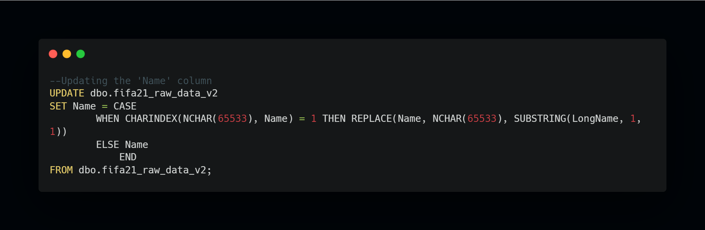
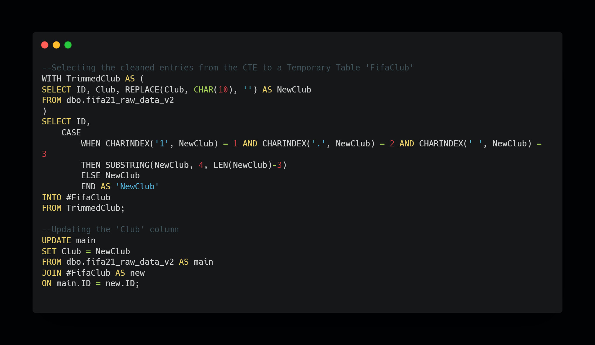
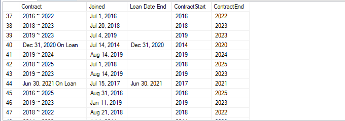
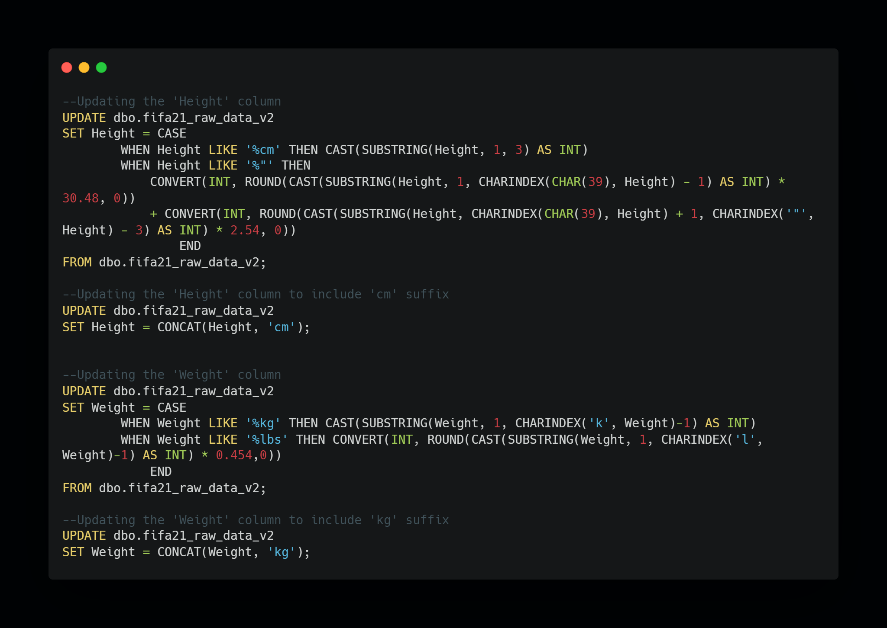
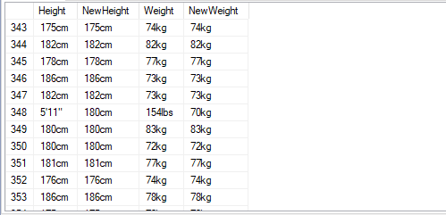
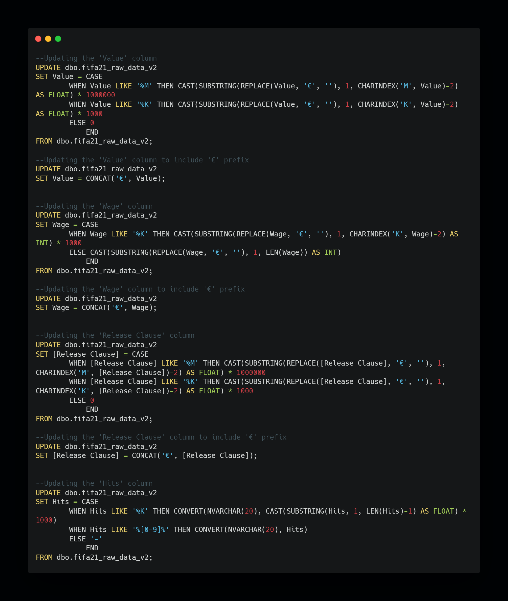
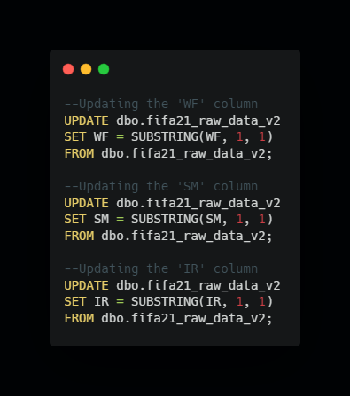
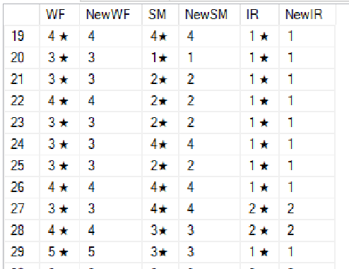

# FIFA 21 DATA CLEANING WITH SQL

## Introduction
This project demonstrates the power and capabilities of SQL in performing data-cleaning tasks. SQL is specifically designed for working with databases and large datasets. It provides efficient query processing, making it well-suited for handling substantial amounts of data during the cleaning process. SQL queries are also explicit and reproducible. By saving and documenting the cleaning steps as SQL scripts, one can easily repeat the process on new data or share the cleaning workflow with others.

As a participant in the data cleaning challenge organized by Victor Somadina and Promise Chinonso, I had previously completed this task with Microsoft Excel but I wanted to put my SQL skills to the test as well.
## About the data set
The data set used was obtained from [Kaggle](https://www.kaggle.com/datasets/yagunnersya/fifa-21-messy-raw-dataset-for-cleaning-exploring). It contains various attributes and statistics of players in the popular video game FIFA 21, such as player ratings, skill moves, preferred positions, and more. The data set consists of 18,979 rows and 77 columns of data.
## The purpose of data cleaning
The purpose of data cleaning, also known as data cleansing or data scrubbing, is to improve the quality and reliability of data by identifying and correcting or removing errors, inconsistencies, and inaccuracies. Data cleaning is an essential step in the data preparation process and plays a crucial role in ensuring the accuracy and integrity of data for analysis, reporting, and decision-making purposes.
## The data cleaning process
### Importing the data set
The CSV file was carefully imported into Microsoft SQL Server Management Studio using the SQL Server Import and Export Wizard. To eliminate the problem of character encoding plaguing the data set, the 'code page' was changed from '1252 (ANSI Latin-I)' to '65001 (UTF-8)' on the wizard's dialog box. The data type of the columns was also changed to the 'Unicode string'.
### Retrieving the table information
The stored procedure 'sp_help' was used to get a summary of the data set. This provided details such as the columns in the table, their data types, any indexes or constraints defined on the table, and other relevant information about the structure of the table.
 Query                 |     Output
:---------------------:|:---------------------:
    |  

Additionally, to get a quick overview of the table, the appropriate query was written to view and count the rows of the data set.
### Cleaning the special character in the 'Name' column
Although changing the character encoding to UTF-8 took care of many occurrences of the special characters. There were still some instances that were yet to be taken care of. A special character 'NCHAR(65533)' was noticed in some entries and it was replaced by the first character in the corresponding LongName column. The resulting outcome can be observed in the 'NewName' column below.
 UPDATE query          |    
:---------------------:|
         | 
  
 Resulting outcome     |
:---------------------:|
         |
### Removing the leading white space and numerical characters in the 'Club' column
It was observed that the special character CHAR(10) along with occurrences of '1. ' were in the front of many entries in the 'Club' column. The REPLACE function was used to clean the special character while a CTE was written to perform further cleaning operations and extract clean data into a temporary table. The difference between the cleaned column and the dirty column can be observed below.
 UPDATE query          |    
:---------------------:|
         | 
  
 Resulting outcome     |
:---------------------:|
         |
### Cleaning the 'Contract' column
The 'Contract' column was observed to have a delimiter that indicated the beginning and end of each player's contract, while some were on loan. Two new columns were created 'ContractStart' and 'ContractEnd' columns to store the extracted values. Upon keen observation, the year in the 'Joined' column matched the 'ContractStart' for each player and this was used in completing the column. The year in the 'Loan Date End' column was also extracted to fill the 'ContractEnd' column for players on loan.
 UPDATE query          |    
:---------------------:|
     | 
  
 Resulting outcome     |
:---------------------:|
     |
### Converting entries in the 'Height' and 'Weight' columns to uniform values
The height of players was measured in centimeters or feet and inches. Since more players had their height measured in centimeters, those measured in feet and inches were converted for the purpose of consistency. A 'CASE' statement was used to achieve this and the approximate conversion factor was applied.

The same approach was applied to the 'Weight' column. Players' weight was measured in kilograms or pounds and since more players had their weight measured in kilograms, those measured in pounds were converted. Below, you can observe the contrast between the cleaned columns and the dirty columns.
 UPDATE query          |    
:---------------------:|
   | 
  
 Resulting outcome     |
:---------------------:|
   |
### Converting instances of 'K' to Thousands and 'M' to Millions in affected columns
The 'Value', 'Wage', Release Clause', and 'Hits' columns had this problem. Entries ending with 'K' were multiplied by 1000 and those ending with 'M' were multiplied by 1000000 for the purpose of accuracy and to enable data aggregation. Below, you can observe the contrast between the cleaned columns and the dirty columns.
 UPDATE query          |    
:---------------------:|
    |  
  
 Resulting outcome     |
:---------------------:|
    |
### Separating special characters from numerical values
The 'WF', 'SM', and 'IR' columns all contained the star symbol which indicated each player's corresponding rating in the game. For the purpose of validity upon further analysis and data aggregation, the columns were updated with the numerical values alone. Observe the 'NewWF', 'NewSM', and 'NewIR' columns below for the cleaned values.
UPDATE query           |   Resulting outcome   |  
:---------------------:|:---------------------:|
         |         |
### Checking and removing duplicate records
A major aspect of the data cleaning process is the removal of duplicate records in the data set in order to maintain data accuracy and integrity. However, one must always make sure that there is indeed a duplicate record before proceeding to delete it.

In this table, the duplicate check revealed that two players named 'Peng Wang' represented the same country, played for the same club, was of the same age, and had the same height. At first, this seemed like a duplicate record, but upon further observation of this record and upon visiting the link in the 'playerUrl' column for additional information, it was clear beyond reasonable doubt that they were different players.
 Query                 |    
:---------------------:|
    |  
  
 Output                |
:---------------------:|
    |
### Dropping irrelevant columns
Another aspect of the data cleaning process is the dropping of irrelevant columns. In order to improve the data analysis process and enhance model performance, it is important to drop irrelevant columns. Doing this will help reduce noise and clutter in the data set and thus improve computational efficiency. However, one must be sure a column is truly irrelevant before performing a permanent drop.

In this table, the 'photoUrl' column can be considered irrelevant since it contains invalid URLs.
 Query                 |    
:---------------------:|
          |

NB: The full SQL script used for cleaning the data is available in my SQL Queries [repository](https://github.com/emmywritescode/SQL-Queries/blob/main/CLEANING%20FIFA%2021%20DATA%20SET.sql) for examination or reuse.
## Conclusion
Through completing this data cleaning project using SQL after having previously done the same task in Microsoft Excel, I have greatly learned and honed my SQL skills. This project provided me with the opportunity to leverage the power and flexibility of SQL for data cleaning and manipulation. 

The experience of completing this data cleaning project with SQL has not only expanded my technical skills but also provided me with a valuable skill set applicable to various data-related tasks. The ability to work with SQL gives me the confidence to tackle more complex data cleaning and manipulation projects in the future, enabling me to be more effective and efficient in my data analysis endeavors.
